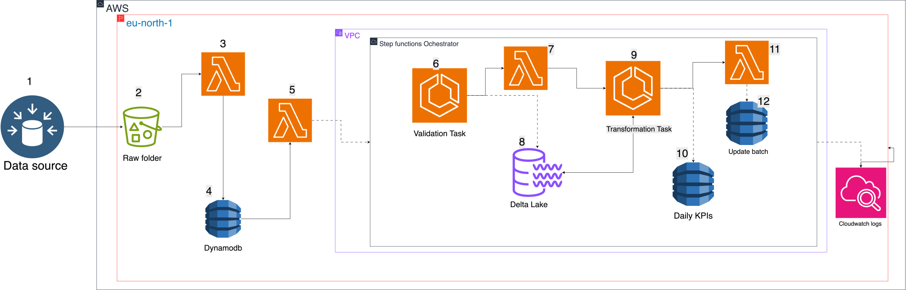
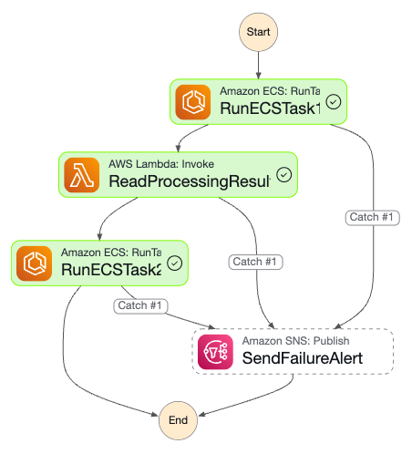

# Ecommerce Data Validation and Transformation Pipeline

## Overview

This project implements a robust, scalable data pipeline for ecommerce data validation and transformation using AWS managed services and Apache Spark. It is designed to efficiently process raw ecommerce data, ensure data quality, and prepare datasets for analytics and reporting.

Key features include:

- Event-driven and scheduled processing with debounce logic to minimize redundant runs.
- Data validation using Spark running in ECS Fargate.
- Orchestration and error handling with AWS Step Functions.
- Intermediate state passing via S3 and Lambda.
- Notifications on failure via SNS.
- Immediate processing of new batch chunks using DynamoDB Streams.

## DynamoDB Table Schemas

### 1. Ingestion / Events Table

This table stores incoming raw event records related to ecommerce data files and supports debounce logic for batching rapid updates.

| Attribute Name | Type | Key Type | Description |
| :-- | :-- | :-- | :-- |
| `group_key` | String | Partition Key | Logical grouping key, e.g., date or batch identifier (e.g., `"2025-07-08"`). |
| `arrival_timestamp` | Number | Sort Key | Timestamp when the event/item arrived (epoch seconds). |
| `batch_start_timestamp` | Number | — | Timestamp representing the batch start time for grouping related events. |
| `data_type_part` | String | — | Identifier for the data type and part, e.g., `"orders#part1"`, `"order_items#part2"`. |
| `s3_path` | String | — | S3 URI path to the raw data file associated with this event. |
| `processed_flag` | Boolean | — | Flag indicating whether this event has been processed by the debounce logic. |
| `debounce_ttl` | Number | — | Timestamp until which debounce logic waits before processing this event (epoch seconds). |

**Additional Notes:**

- **TTL (Time To Live):** You can configure DynamoDB TTL on `debounce_ttl` to automatically expire old events.
- **Use Case:** This table acts as a temporary event store for debounce logic, allowing the system to batch rapid incoming events before triggering processing.

### 2. Batch Chunks Table

This table stores batch chunks created after debounce logic expires, representing grouped file paths ready for processing.

| Attribute Name | Type | Key Type | Description |
| :-- | :-- | :-- | :-- |
| `group_key` | String | Partition Key | Logical grouping key, e.g., date or batch identifier (e.g., `"2025-07-08"`). |
| `batch_id` | String | Sort Key | Unique identifier for the batch chunk, typically combining date, group key, timestamp, and chunk index. |
| `batch_start_timestamp` | Number | — | Timestamp representing the batch start time for the chunk (epoch seconds). |
| `file_paths` | List | — | List of S3 URI strings for the files included in this batch chunk. |
| `status` | String | — | Status of the batch chunk lifecycle, e.g., `"pending"`, `"processing"`, `"completed"`. |
| `created_at` | Number | — | Epoch timestamp when the batch chunk was created. |
| `execution_arn` | String | — | ARN of the Step Functions execution started for this batch chunk (populated when processing starts). |
| `processing_started_at` | Number | — | Epoch timestamp when processing started (optional). |

## 1. Orders Table

| Attribute | Role | Reason |
| :-- | :-- | :-- |
| **Partition Key:** `order_id` | Partition Key | Uniquely identifies each order. Using `order_id` as partition key allows fast lookups. |
| **Sort Key:**  `created_at` | Sort Key |  |

### Typical usage:

- If you mostly access orders by `order_id`, just use `order_id` as the partition key and no sort key.
- If you want to query all orders for a user, consider a **Global Secondary Index (GSI)** with `user_id` as partition key and `created_at` as sort key.

## 2. Category Table

| Attribute | Role | Reason |
| :-- | :-- | :-- |
| **Partition Key:** `category_id` | Partition Key | Unique identifier for each category. |
| **Sort Key:**  `order_date` | Sort Key |  |

**Additional Notes:**

- **DynamoDB Streams:** Enable Streams with **"New image"** view type on this table to trigger Lambda functions immediately when new batch chunks are created or updated.
- **Use Case:** This table represents the units of work for your processing pipeline. Each batch chunk groups related files for validation and transformation.

## Summary Table Comparison

| Feature | Ingestion / Events Table | Batch Chunks Table |
| :-- | :-- | :-- |
| Primary Key | `group_key` (Partition), `arrival_timestamp` (Sort) | `group_key` (Partition), `batch_id` (Sort) |
| Main Purpose | Store raw event metadata for debounce | Store grouped batch chunks for processing |
| Key Attributes | `data_type_part`, `s3_path`, `processed_flag`, `debounce_ttl` | `file_paths`, `status`, `execution_arn` |
| TTL Support | Yes, on `debounce_ttl` | No (optional) |
| DynamoDB Streams | Optional (for debounce Lambda triggers) | Enabled with "New image" for Lambda triggers |
| Typical Status Values | `processed_flag` (boolean) | `"pending"`, `"processing"`, `"completed"` |

## Architecture and Data Flow

## 1. **The data comes in from the source**
Raw ecommerce data files such as `orders`, `order_items`, and `products` are generated by the source system.

## 2. **The data sits in the S3 bucket raw folder**
These raw data files are uploaded into the designated S3 bucket under the `raw/` folder, organized by data type.

## 3. **A Lambda function writes this data into the ingestion table in DynamoDB where it sits and the debounce marks it**
A Lambda function monitors the S3 bucket or receives events and writes metadata about these files into the DynamoDB ingestion table. This table acts as an event store, and the Lambda applies debounce logic by marking items with timestamps to batch rapid incoming events.

## 4. **The debounce mechanism waits for a configured time window**
This allows the system to batch related events and avoid redundant processing triggered by frequent file arrivals.

## 5. **Once the debounce time has elapsed, a Lambda groups the files into a batch and writes a batch chunk to DynamoDB**
When the debounce TTL expires and no new files arrive, a scheduled Lambda checks for expired items in the ingestion table, groups them into a batch, and writes this batch metadata into the `batch_chunks` DynamoDB table with a unique `batch_id`.

## 6. **The stream-triggered Lambda reacts to the new batch chunk and starts the Step Function**
This Lambda is triggered automatically by a **DynamoDB Streams event** when a new batch chunk is inserted. It reads the batch metadata, categorizes the file paths (`orders`, `order_items`, `products`), and starts the **Step Functions** workflow with this structured input. It also updates the batch chunk’s status to `processing`.

## 7. **Separately, the controller Lambda ensures only one batch is processed at a time**
Running on a **schedule**, this Lambda checks if any batch chunk is already being processed.  
If none are found, it fetches the **next pending** batch chunk and starts its Step Function.  
This guarantees that only one batch is in flight at a time and ensures orderly, sequential processing.

## 8. **The validation task starts with the files from the batch and writes to the Delta Lake**
The Step Functions state machine kicks off an **ECS Fargate Spark job** that validates the batch files.  
This job reads the raw data from S3, performs **data quality checks** (e.g., nulls, referential integrity), and writes the **validated data into Delta Lake format**, stored back in S3.

## 9. **A Lambda function passes the success message to the transformation task which runs and writes to the KPI DynamoDB table**
After validation completes, a Lambda function reads the validation result (success or failure) from S3 and signals the next Step Functions state.  
The **transformation ECS Spark job** then runs, processing the validated data and writing **KPI or aggregated results** into a dedicated DynamoDB table for downstream analytics.

## 10. *(Implicit)* The transformation task completes writing data and signals success or failure

## 11. *(Implicit)* Step Functions handles retries or error notifications if any task fails

## 12. **The KPI DynamoDB table stores the transformed and aggregated results for reporting and analytics**

## 13. **A Lambda updates the batch status to `done` and then ends the Step Function**
Upon successful completion of all tasks, a Lambda updates the batch chunk item in DynamoDB to mark it as `done`, signaling that processing is complete.  
The Step Functions execution then ends, freeing the pipeline to process new batches.

The pipeline is ready to start processing the next batch when new data arrives.

### 1. Data Ingestion and Event Capture

- Raw ecommerce data files (orders, order_items, products) arrive in an S3 bucket (`lab6-bucket-ecs`) under structured prefixes.
- For event-driven updates or incremental data, events are captured in a DynamoDB table keyed by entity IDs (e.g., order ID).
- This DynamoDB table acts as a temporary event store for debounce logic.

### 2. Debounce Scheduling Using DynamoDB and Lambda

- A **debounce mechanism** batches rapid incoming events:
    - New events update items in DynamoDB with timestamps.
    - A Lambda function is triggered by DynamoDB Streams on item updates.
    - The Lambda checks if the event timestamp is older than a configured debounce window (e.g., 10 minutes).
    - If no new updates occur within the window, the Lambda creates a batch chunk in a separate DynamoDB table.
- This reduces redundant processing and optimizes resource usage.

### 3. Batch Chunk Creation and Real-Time Processing

- When the debounce window expires, the Lambda creates a **batch chunk** item in the batch chunks DynamoDB table.
- **DynamoDB Streams** are enabled on the batch chunks table (with "New image" view type).
- A dedicated Lambda function is triggered immediately on new batch chunk creation:
    - It splits the `file_paths` field into `orders_paths`, `order_items_paths`, and `products_path`.
    - It starts the Step Functions workflow with these paths as input.
    - It updates the batch chunk status to `"processing"` and records the Step Function execution ARN.

### 4. Step Functions Orchestration

- The Step Functions state machine manages the workflow with the following key states:

1. **RunECSTask1 (Validation ECS Task):**
Runs a Spark validation job in ECS Fargate that:
        - Reads raw data from S3.
        - Validates data for nulls and referential integrity.
        - Writes validated Delta tables partitioned by processing date back to S3.
        - Writes a JSON processing result file (status and processing date) to S3.
2. **passresult (Lambda):**
Reads the JSON result file from S3 and returns it to Step Functions for downstream use.
3. **RunECSTask2 (Transformation ECS Task):**
Runs a Spark transformation job using the validated data and processing date.
4. **SendFailureAlert (SNS Notification):**
Sends alerts on failure after retries are exhausted.
- Step Functions handles retries, error catching, and state transitions.

### 5. Data Storage and Formats

| Data Stage | Location (S3 Prefix) | Format |
| :-- | :-- | :-- |
| Raw Data | `s3://lab6-bucket-ecs/raw/` | CSV or Delta |
| Validated Data | `s3://lab6-bucket-ecs/validated/` | Delta tables |
| Processing Result JSON | `s3://lab6-bucket-ecs/validation_output/` | JSON |
| Transformed Data | Configurable output prefix | Delta or other |

## Components and Technologies

| Component | Purpose | AWS Service / Technology |
| :-- | :-- | :-- |
| DynamoDB | Event storage and debounce control | AWS DynamoDB |
| Lambda | Debounce logic and S3 JSON reading | AWS Lambda |
| EventBridge Scheduler | Scheduled workflow triggers | Amazon EventBridge Scheduler |
| Step Functions | Workflow orchestration | AWS Step Functions |
| ECS Fargate | Spark job execution (validation, transformation) | Amazon ECS Fargate + Apache Spark |
| S3 | Data and intermediate output storage | Amazon S3 |
| SNS | Failure notifications | Amazon SNS |

## Environment Variables

| Variable | Description | Example Value |
| :-- | :-- | :-- |
| `S3_BUCKET_NAME` | S3 bucket name for data storage | `lab6-bucket-ecs` |
| `ORDERS_PATH` | S3 path to raw orders data | `s3://lab6-bucket-ecs/raw/orders/file_part1.csv` |
| `ORDER_ITEMS_PATH` | S3 path to raw order items data | `s3://lab6-bucket-ecs/raw/order_items/filename_part1.csv` |
| `PRODUCTS_PATH` | S3 path to raw products data | `s3://lab6-bucket-ecs/raw/products/products.csv` (optional) |
| `PROCESSING_RESULT_S3_KEY` | S3 key for validation result JSON | `validation_output/result.json` |

## Deployment and Usage

1. **Build and push Spark job container images** to Amazon ECR.
2. **Create ECS task definitions** for validation and transformation tasks, injecting environment variables.
3. **Deploy Lambda functions**:
    - Debounce trigger Lambda (optional).
    - Processing result reader Lambda.
4. **Create DynamoDB table** for event capture with appropriate keys and TTL if needed.
5. **Configure EventBridge Scheduler** for periodic Step Functions execution.
6. **Deploy Step Functions state machine** with updated ARNs and environment variables.
7. **Run the workflow** by triggering Step Functions manually, via DynamoDB events, or scheduled runs.

## Monitoring and Alerts

- Use **CloudWatch Logs** for ECS tasks and Lambda functions.
- Monitor **Step Functions executions** via AWS Console.
- Receive failure notifications via **SNS** topic subscription.

## Troubleshooting Tips

- **NoSuchKey errors in Lambda:** Verify the processing result JSON is written to the exact S3 key expected.
- **Missing processing result JSON:** Confirm ECS Spark job calls the S3 write function and has correct permissions.
- **Step Functions failures:** Inspect ECS container logs and ensure proper exit codes.
- **Debounce issues:** Check DynamoDB stream and Lambda debounce logic timing.
- **Batch chunk not processed:** Ensure DynamoDB Streams are enabled on the batch chunks table and the Lambda trigger is active.
- **Step Function input errors:** Confirm the Lambda splits `file_paths` into `orders_paths`, `order_items_paths`, and `products_path` before starting the Step Function.

## Best Practices \& Notes

- **DynamoDB Streams View Type:** Use **"New image"** so your Lambda receives the full item data on insert/update.
- **IAM Permissions:** Ensure Lambda functions have appropriate permissions for DynamoDB, Step Functions, and S3.
- **Idempotency:** Design Lambda to handle possible duplicate events from DynamoDB Streams.
- **Batch Chunk Structure:** Each batch chunk should include `batch_id`, `group_key`, `batch_start_timestamp`, `file_paths`, `status`, and `created_at`.

