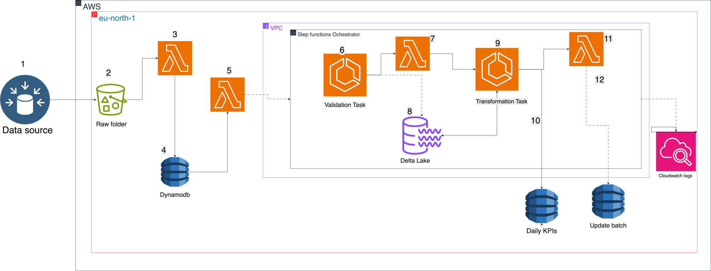
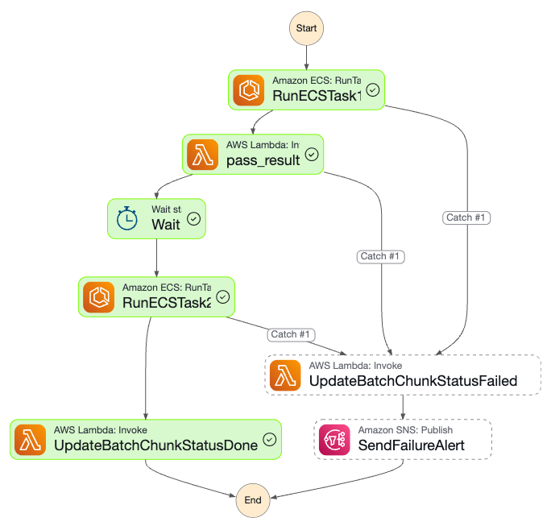

# Ecommerce Data Validation and Transformation Pipeline

## Overview

This project implements a robust, scalable data pipeline for ecommerce data validation and transformation using AWS managed services and Apache Spark. It is designed to efficiently process raw ecommerce data, ensure data quality, and prepare datasets for analytics and reporting.

Key features include:

- Event-driven and scheduled processing with debounce logic to minimize redundant runs.
- Data validation using Spark running in ECS Fargate.
- Orchestration and error handling with AWS Step Functions.
- Intermediate state passing via S3 and Lambda.
- Notifications on failure via SNS.

## Architecture and Data Flow

### 1. Data Ingestion and Event Capture

- Raw ecommerce data files (orders, order_items, products) arrive in an S3 bucket (`lab6-bucket-ecs`) under structured prefixes.
- For event-driven updates or incremental data, events are captured in a DynamoDB table keyed by entity IDs (e.g., order ID).
- This DynamoDB table acts as a temporary event store for debounce logic.

### 2. Debounce Scheduling Using DynamoDB and Lambda

- To avoid triggering processing on every single event, a **debounce mechanism** is implemented:
    - Incoming events update DynamoDB items with timestamps.
    - DynamoDB Streams trigger a Lambda function on updates.
    - The Lambda checks if the event timestamp is older than a configured debounce window (e.g., 10 minutes).
    - If no new updates occur within the window, the Lambda triggers the Step Functions workflow.
- This approach batches rapid events into a single processing run, improving efficiency and reducing costs.

### 3. Scheduled Processing with Amazon EventBridge Scheduler

- In addition to event-driven triggers, **EventBridge Scheduler** can invoke the Step Functions workflow on a fixed schedule (e.g., hourly or daily).
- This ensures regular batch processing even if no events arrive.

### 4. Step Functions Orchestration

- The Step Functions state machine manages the workflow with the following key states:

1. **RunECSTask1 (Validation ECS Task):**
Runs a Spark validation job in ECS Fargate that:
        - Reads raw data from S3.
        - Validates data for nulls and referential integrity.
        - Writes validated Delta tables partitioned by processing date back to S3.
        - Writes a JSON processing result file (status and processing date) to S3.
2. **ReadProcessingResult (Lambda):**
Reads the JSON result file from S3 and returns it to Step Functions for downstream use.
3. **RunECSTask2 (Transformation ECS Task):**
Runs a Spark transformation job using the validated data and processing date.
4. **SendFailureAlert (SNS Notification):**
Sends alerts on failure after retries are exhausted.
- Step Functions handles retries, error catching, and state transitions.

### 5. Data Storage and Formats

| Data Stage | Location (S3 Prefix) | Format |
| :-- | :-- | :-- |
| Raw Data | `s3://lab6-bucket-ecs/raw/` | CSV or Delta |
| Validated Data | `s3://lab6-bucket-ecs/validated/` | Delta tables |
| Processing Result JSON | `s3://lab6-bucket-ecs/validation_output/` | JSON |
| Transformed Data | Configurable output prefix | Delta or other |

## Components and Technologies

| Component | Purpose | AWS Service / Technology |
| :-- | :-- | :-- |
| DynamoDB | Event storage and debounce control | AWS DynamoDB |
| Lambda | Debounce logic and S3 JSON reading | AWS Lambda |
| EventBridge Scheduler | Scheduled workflow triggers | Amazon EventBridge Scheduler |
| Step Functions | Workflow orchestration | AWS Step Functions |
| ECS Fargate | Spark job execution (validation, transformation) | Amazon ECS Fargate + Apache Spark |
| S3 | Data and intermediate output storage | Amazon S3 |
| SNS | Failure notifications | Amazon SNS |

## Environment Variables

| Variable | Description | Example Value |
| :-- | :-- | :-- |
| `S3_BUCKET_NAME` | S3 bucket name for data storage | `lab6-bucket-ecs` |
| `ORDERS_PATH` | S3 path to raw orders data | `s3://lab6-bucket-ecs/raw/orders/file_part1.csv` |
| `ORDER_ITEMS_PATH` | S3 path to raw order items data | `s3://lab6-bucket-ecs/raw/order_items/filename_part1.csv` |
| `PRODUCTS_PATH` | S3 path to raw products data | `s3://lab6-bucket-ecs/raw/products/products.csv` (optional) |
| `PROCESSING_RESULT_S3_KEY` | S3 key for validation result JSON | `validation_output/result.json` |

## Deployment and Usage

1. **Build and push Spark job container images** to Amazon ECR.
2. **Create ECS task definitions** for validation and transformation tasks, injecting environment variables.
3. **Deploy Lambda functions**:
    - Debounce trigger Lambda (optional).
    - Processing result reader Lambda.
4. **Create DynamoDB table** for event capture with appropriate keys and TTL if needed.
5. **Configure EventBridge Scheduler** for periodic Step Functions execution.
6. **Deploy Step Functions state machine** with updated ARNs and environment variables.
7. **Run the workflow** by triggering Step Functions manually, via DynamoDB events, or scheduled runs.

## Monitoring and Alerts

- Use **CloudWatch Logs** for ECS tasks and Lambda functions.
- Monitor **Step Functions executions** via AWS Console.
- Receive failure notifications via **SNS** topic subscription.

## Troubleshooting Tips

- **NoSuchKey errors in Lambda:** Verify the processing result JSON is written to the exact S3 key expected.
- **Missing processing result JSON:** Confirm ECS Spark job calls the S3 write function and has correct permissions.
- **Step Functions failures:** Inspect ECS container logs and ensure proper exit codes.
- **Debounce issues:** Check DynamoDB stream and Lambda debounce logic timing.

